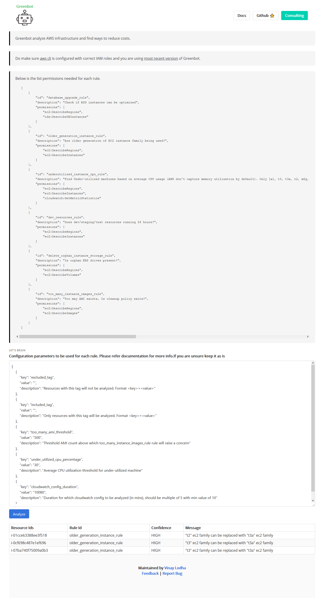

# Getting Started

* Make sure you have JDK 8 installed \(AWS SDK is incompatible with JDK 9 and above\)
* Configure AWS cli using `aws configure`
  * [AWS cli guide](https://docs.aws.amazon.com/cli/latest/userguide/cli-chap-welcome.html)
* Download ****jar from [GreenBot release](https://github.com/vinay-lodha/greenbot/releases)
* Open terminal and execute `java -jar main-1.0.0.jar`, application should now be up on [`http://localhost:5000`](http://localhost:5000)\`\`

### Permissions

Below are the aggregated permissions IAM user need for execution all rules.

* [ec2:DescribeRegions](https://docs.aws.amazon.com/AWSEC2/latest/APIReference/API_DescribeRegions.html)
* [ec2:DescribeInstances](https://docs.aws.amazon.com/AWSEC2/latest/APIReference/API_DescribeInstances.html)
* [ec2:DescribeVolumes](https://docs.aws.amazon.com/AWSEC2/latest/APIReference/API_DescribeVolumes.html)
* [ec2:DescribeImages](https://docs.aws.amazon.com/AWSEC2/latest/APIReference/API_DescribeImages.html)
* [cloudwatch:GetMetricStatistics](https://docs.aws.amazon.com/AmazonCloudWatch/latest/APIReference/API_GetMetricStatistics.html)
* [rds:DescribeDBInstances](https://docs.aws.amazon.com/cli/latest/reference/rds/describe-db-instances.html)

### Screenshot

